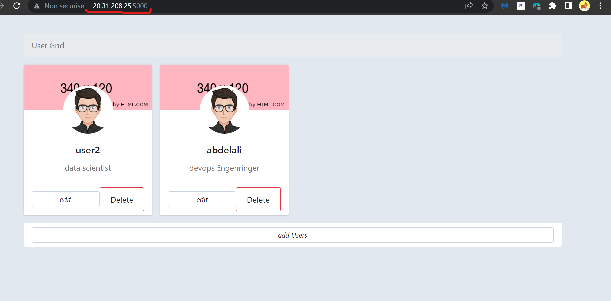

# K8S-APP-CI-CD 

In this project we will create :
- 1 - Create a Kubernetes cluster with Azure Kubernetes Service using Terraform
[` Kubernetes cluster with Terraform`](https://github.com/bendraabdelali/K8s-CI-Cd-Azure-Devops-Terraform-#1--create-a-kubernetes-cluster-with-terraform)
- 2 - Create mongodb database and Prometheuse and Grfana using Terraform and helm .  
- 3 -Github Action pipeline that continuously build ,test  our app . and trriger  Azure Devops  Pipelines.
- 4 -Azure Devops pipeline that continuously deploys to  AKS.  the images are pushed to  DockerHub  and the manifests are then deployed to  AKS cluster.
<br>


<p align="center">
  
</p>

##  Prerequisites

To run this project, you will need to install 

- [`Azure Account`](https://azure.microsoft.com/en-us/free/?WT.mc_id=A261C142F) 
- [`Azure Devops Account`](https://azure.microsoft.com/en-us/products/devops/)
- [`Azure Cli`](https://learn.microsoft.com/en-us/cli/azure/install-azure-cli)
- [`Terrafrom`](https://developer.hashicorp.com/terraform/tutorials/aws-get-started/install-cli)
- [`Kubectl`](https://kubernetes.io/docs/tasks/tools/)

## Usage
### 1- Create a Kubernetes cluster with Terraform 
 ```bash
  cd IAC
  az login
  Terraform apply 
```
Verify the health of the cluster
 ```bash
  kubectl get nodes
  kubect get pods 
  kubectl get all -n monitoring
```
#### Acces Grafana 

 ```bash
   kubectl get svc prometheus-grafana -n monitoring
```
- copy the  external ip and past it into browser  to use grafana Dashboard
- user:admin password: admin
- 

#### Acces Prometheus
 ```bash
 kubectl port-forward prometheus-prometheus-prometheus-0  80:9090 -n monitoring
```
 - 

### 2- Run  the pipeline
To Run the pipeline Just push new Commit in the main branch 
### 3- Check the pipeline 
#### - Azure Pipline 
 
#### - Docker Hub new Images is pushed 
 
 #### - check the realese Pipeline
 

## Access to Application 
#### 
 ```bash
 kubectl get svc myapp-svc -n monitoring 
```
copy the  external ip and past it into browser  to use the application


## Built With
- Github Action
- Azure Devops
- Terrafrom
- Kubernetes
- Azure
- Docker
- Grafana
- Prometheus
- Mongo DB
- Flask


## Authors
Bendra Abdelali
- [Profile](https://github.com/bendraabdelali)
- [Linkedin](https://www.linkedin.com/in/abdelali-bendra-934755182/)
- [Kaggle](https://www.kaggle.com/bendraabdelali)
